# paper2video

A Claude Code skill that turns a research paper or project into a polished explainer / promo video, in the style of 3Blue1Brown, built with [Remotion](https://www.remotion.dev).

Give Claude this skill and a link to the work: a GitHub repo, an arXiv paper, a project page, or a working directory it can read. It then produces the whole video:

- **Story and script**, written for viewers with no context and checked claim by claim against the paper.
- **Narration** in several forms:
  - ElevenLabs (optional key);
  - free edge-tts voices;
  - your own recording;
  - no voice at all.
- **Animations built from real data**, with word-timed captions, music with ducking and subtle sound design.
- **Two languages**: English and Chinese cuts, plus an optional vertical (9:16) cut.
- **Publishing kit**: covers, titles, descriptions and chapters for YouTube and Bilibili, and on request any other platform.
- **Editor handoff**: stems, SRT captions and EDL markers if you want to finish in your own editing app.

## Showcase

Two videos made with this workflow:

| | English (YouTube) | Chinese (Bilibili) |
|---|---|---|
| **Transformers Stop Thinking Too Early, and a Tiny LoRA Fixes It** · [project page](https://lunamos.github.io/stop-thinking-too-early/) | [▶ YouTube](https://youtu.be/zauTNrrZQW8) | [▶ Bilibili](https://www.bilibili.com/video/BV1Ymad68Eof) |
| **FLAS: Beyond Steering Vector** (NeurIPS 2026) · [project page](https://flas-ai.github.io) | [▶ YouTube](https://youtu.be/5Tg7fNdvvvs) | [▶ Bilibili](https://www.bilibili.com/video/BV16Wa76aEnL) |

**Hook, task and failure.** The paper's hero visual, built from real data, opens the film. A primer then explains the task, and the models' actual accuracy curves show where they fail.

<p>
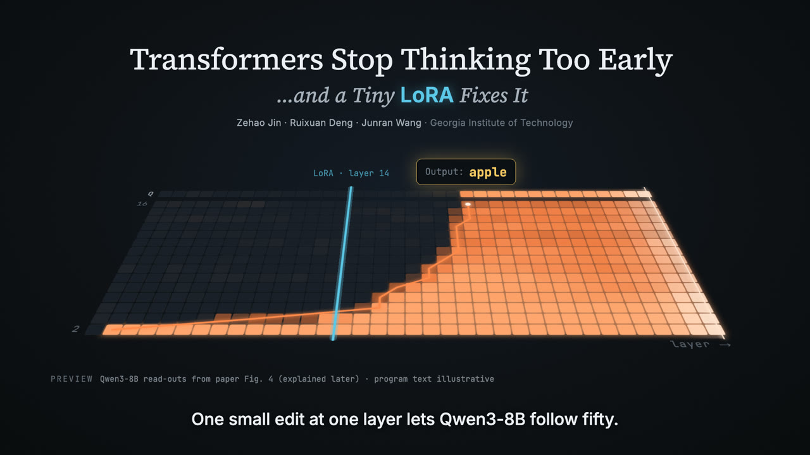 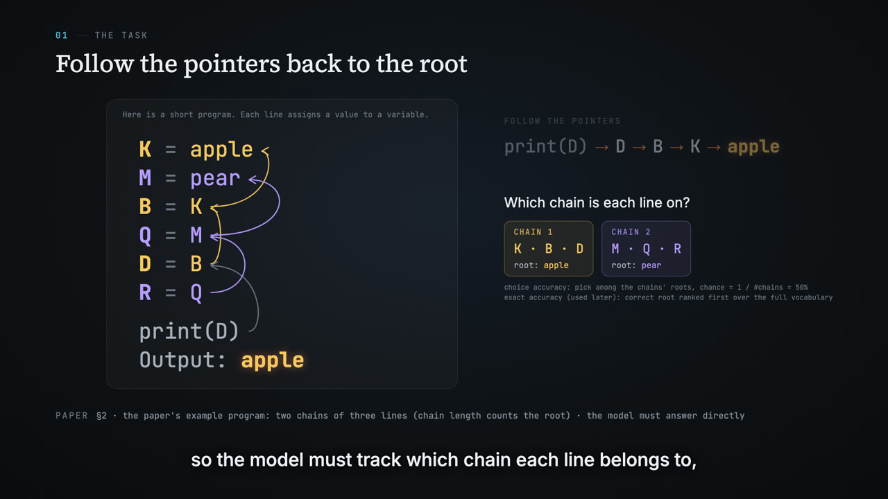 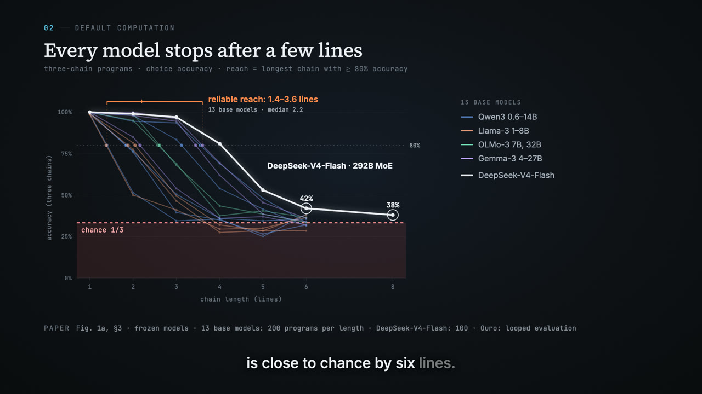
</p>

**Mechanism and results.** A layer cursor sweeps a heatmap of real read-out data. Every chart has a source line, and caveats are shown rather than hidden.

<p>
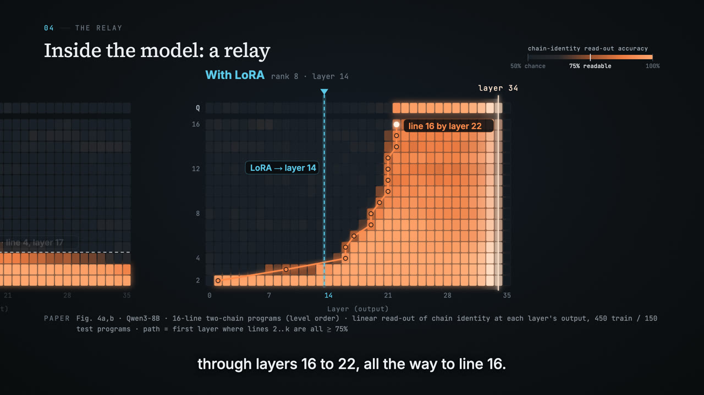 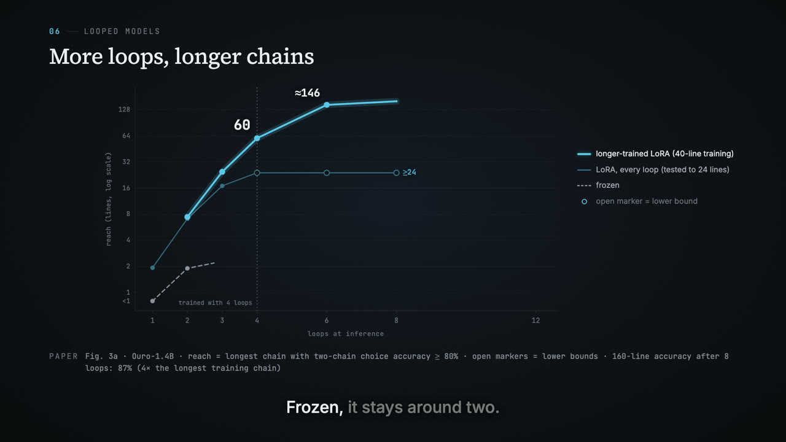 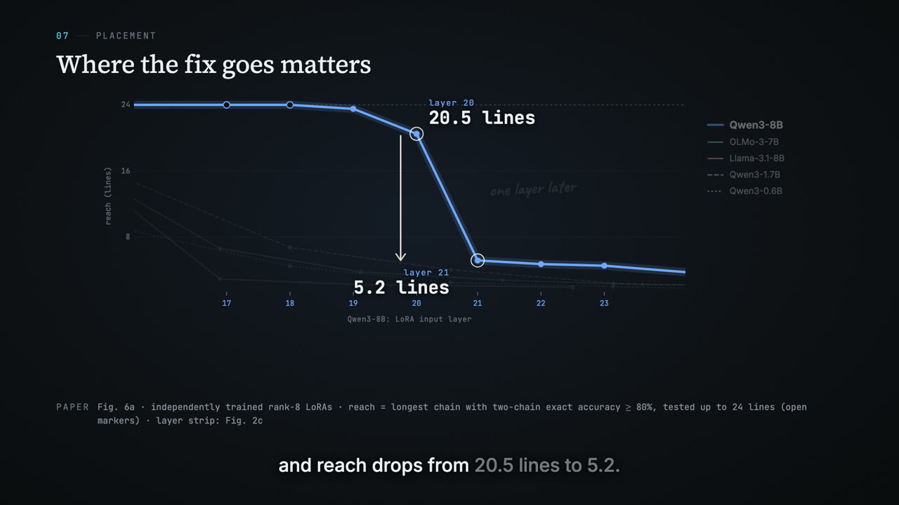
</p>

**Real model outputs and trajectories.** Steered text is typed out with its key phrases highlighted, the 3D trajectories are the paper's own, and a strength dial runs over the robustness curves.

<p>
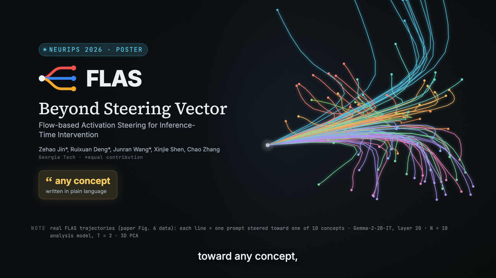 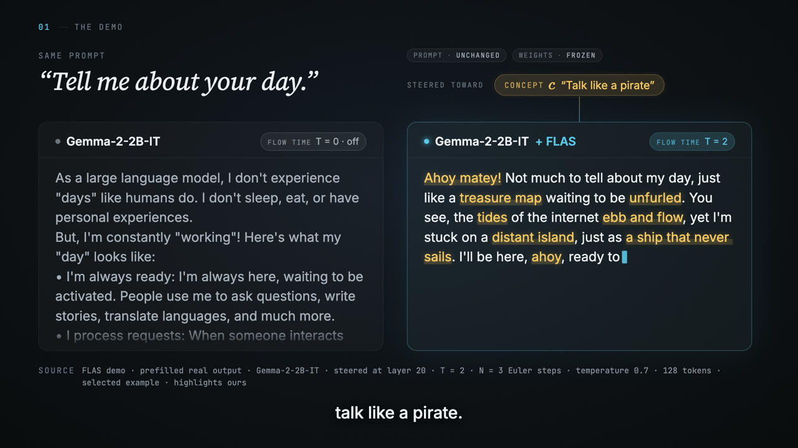 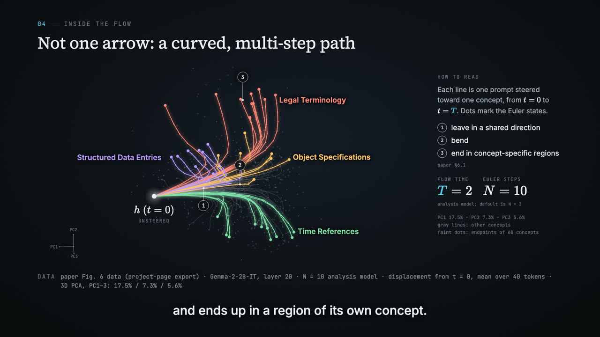 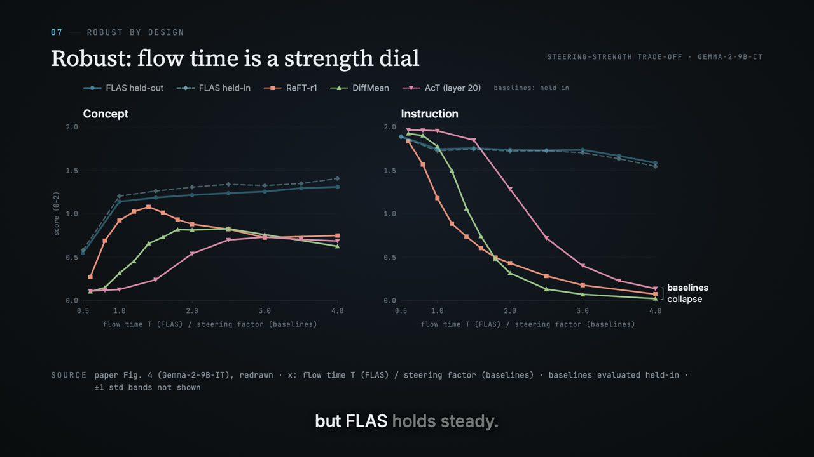
</p>

**Covers and vertical cuts.**

<p>
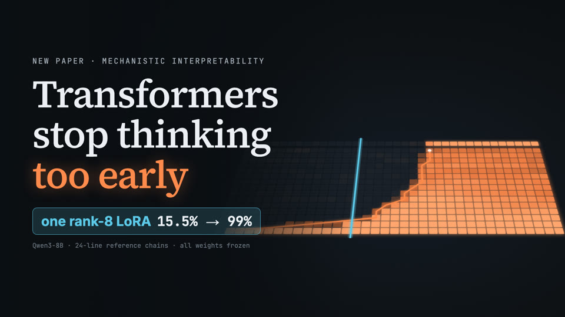 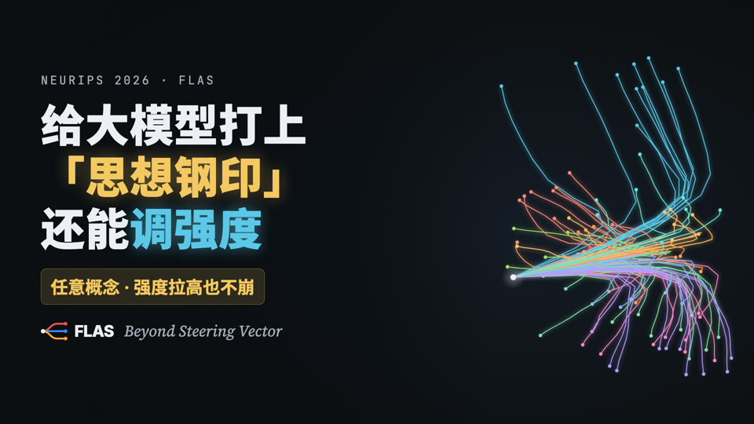
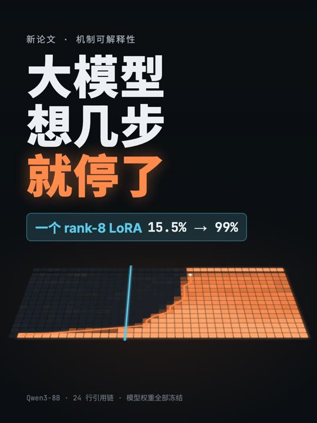 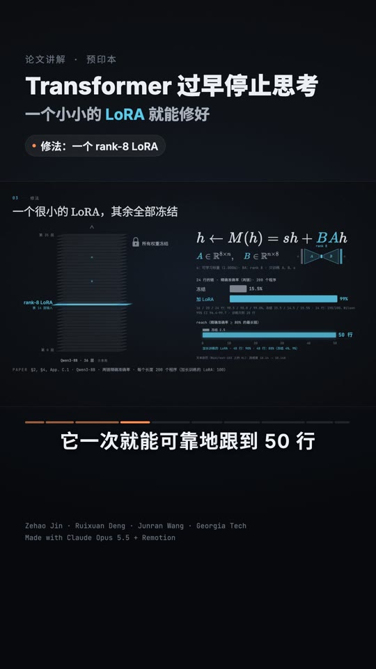
</p>

## Install

With the [skills CLI](https://github.com/vercel-labs/skills):

```bash
npx skills add Lunamos/paper2video
```

Or manually:

```bash
git clone https://github.com/Lunamos/paper2video
cp -r paper2video/skills/paper2video ~/.claude/skills/
```

You don't need to set up Remotion yourself. The skill tells Claude to:

- create the Remotion project;
- install the official Remotion agent skills;
- copy in the template;
- install whatever it needs (Node packages, and `uv` for the Python helpers).

You only need Node.js 18+, ffmpeg and Python 3.10+ on the machine.

**Optional:** set `ELEVENLABS_API_KEY` in the environment or in the project's `.env` to get the most expressive narration and a generated music bed. Without a key, the skill uses free edge-tts voices, or your own recording, or no voice. It never prints or commits the key.

## Use

```
Use the paper2video skill to make an explainer video for https://github.com/<you>/<repo>
(paper: https://arxiv.org/abs/xxxx.xxxxx). English for YouTube and Chinese for Bilibili,
third person, keep it under 4 minutes.
```

You can also point it at a local folder or a server it can read. It asks only what it can't sensibly default, then works end to end. Afterwards, give feedback the way you would to an editor, e.g. "at 1:42 the chart jitters" or "the opening sounds abrupt". It maps timestamps to scenes and re-renders only what changed.

To collaborate, drop logos, screen recordings, photos, a music track or your own narration into the project. To finish in Premiere, Final Cut, DaVinci or 剪映, ask for the handoff export.

## What's inside

```
skills/paper2video/
  SKILL.md              the workflow: intake → understanding → script → data → voice → scenes → fact-check → render → deliverables
  reference/            rigor, voice, visual style, platforms (YouTube + Bilibili), third-party papers from an
                        arXiv link (finding data, digitising figures, CPU illustrations), materials & editor handoff
  scripts/              voice-over pipeline (ElevenLabs / edge-tts / recorded / none) with ASR QA, music, SFX,
                        captions, mastering, vertical cut, handoff export, contact sheets, figure-data
                        extraction (vector PDFs, colormaps, digitising), final-file checks
  template/             Remotion starter: theme, captions, anchor-driven timeline, scene shell, vertical layout, covers
```

## Principles

- **Truth over hype.** Every number traces to the paper. Illustrations are labelled, and so are selected examples.
- **Real data early.** The strongest real visual goes in the first seconds, followed by a primer so anyone can follow.
- **Motion explains.** Strokes draw on and beats are timed to the voice. There are no count-up numbers and no full-frame shake.
- **The work is the pitch.** The tools that made the video get a credit line, nothing more.

## License

MIT for the skill, scripts and template. The showcase videos and images belong to their authors.
